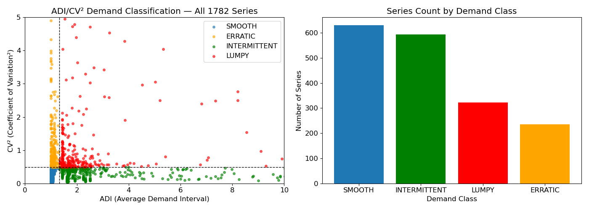
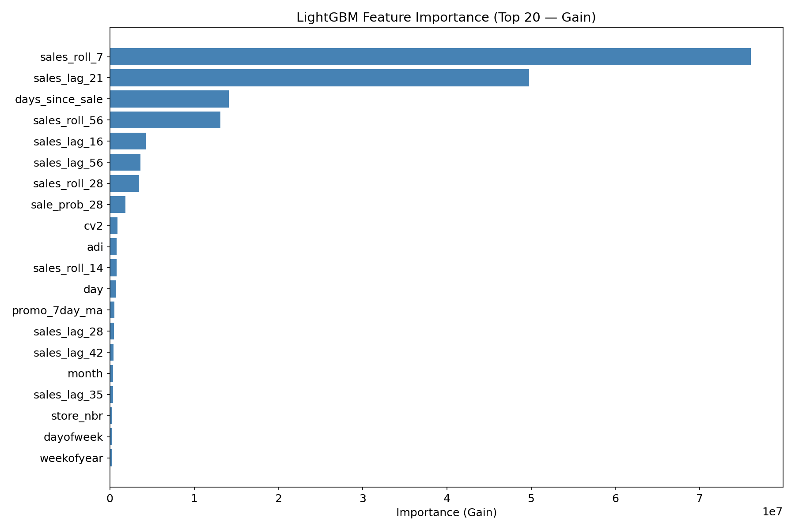
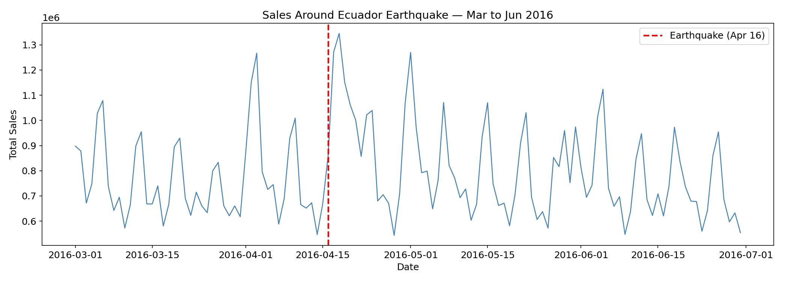
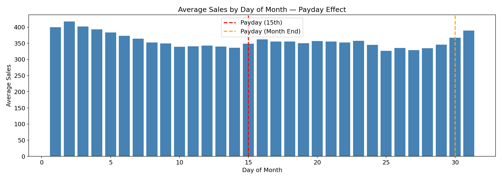

# Store Sales Forecasting — Favorita (Ecuador)

**16-day-ahead daily demand forecasting across 1,782 store × product-family series**, built with the discipline of a production replenishment system — not a leaderboard sprint.

> **Headline:** validation RMSLE **0.384**, leaderboard **0.426** — a fully diagnosed climb from an initial leaking baseline of 0.515. Every basis point of that improvement is traceable to a specific, evidence-tested decision.

---

## Demand Classification (ADI/CV²)

1,782 series segmented into SMOOTH / ERRATIC / INTERMITTENT / LUMPY using Syntetos-Boylan thresholds. ~57% of total forecast error concentrated in the LUMPY/INTERMITTENT classes — genuinely sparse demand where a single global regressor hits a hard ceiling.

## Why this project

[... keep the rest of your original README text here ...]

## Model: what actually drives the forecast

Recent rolling sales (`sales_roll_7`) and `sales_lag_21` dominate — confirmed by a deliberate ablation test where I stripped the model down to *only* sales history and calendar skeleton (no oil, no promo, no holidays). That lean model scored **0.455**, meaningfully worse than the full 52-feature model's **0.384** — proving the "minor" contextual features carry real signal collectively, even though none dominates individually.

## Domain-specific signals

|  |  |
|---|---|

The April 2016 Ecuador earthquake caused a visible sales surge (ruled out as an August confound after checking the date). Payday effects (15th / month-end) show clear spikes, consistent with Ecuador's bi-monthly wage cycle.

[... rest of README continues as before: approach table, diagnostic journey, what I rejected, overfitting note, tech stack, about ...]
